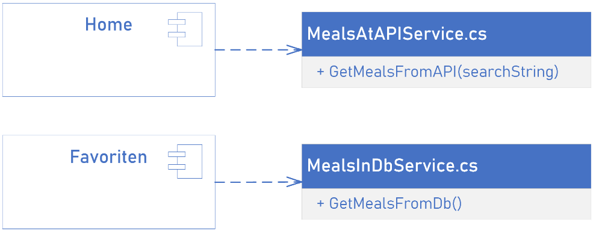

# Inhaltsverzeichnis

[1 Einführung und Ziele](#einfuhrung-und-ziele)  
[2 Randbedingungen](#randbedingungen)  
[3 Kontextabgrenzung](#kontextabgrenzung)  
[4 Lösungsstrategie](#losungsstrategie)  
[5 Bausteinsicht](#bausteinsicht)  
[6 Laufzeitsicht](#laufzeitsicht)  
[7 Verteilungssicht](#verteilungssicht)  
[8 Querschnittliche Konzepte](#querschnittliche-konzepte)  
[9 Architekturentscheidungen](#architekturentscheidungen)  
[10 Qualitätsanforderungen](#qualitatsanforderungen)  
[11 Risiken und technische Schulden](#risiken-und-technische-schulden)  
[Glossar](#glossar)  

# 1 Einführung und Ziele

Dieses Dokument beschreibt die Software-Architektur des Rezepte-Systems. Das System dient dem Finden und Abspeichern von Rezepten. Es soll im Internet einem breiten Publikum zur Verfügung stehen.

[comment]: <> (#############################################################################)

## 1.1 Qualitätsziele

Die folgende Tabelle beschreibt die zentralen Qualitätsziele des Rezeptesystems. Die Reihenfolge gibt dabei eine grobe Orientierung bezüglich der Wichtigkeit vor. 
Die Umsetzung derQualitätsziem im Kapitel Lösungsstrategie zu finden.

| Qualitätsmerkmal | Ziel |
|-----------------|-----------------------------------|
| Wartbarkeit |  |
| Performance |  |
| Security | Interne Schnittstellen des Rezeptesystem sind abgesichert. |
| Erweiterbarkeit | Das Rezeptesystem lässt sich leicht um neue Funktionalität(en) erweitern. Es kann auf lange Sicht dem technologischen Fortschritt bei Tools folgen.|
| Erlernbarkeit | Entwickler finden sich schnell im Rezeptesystem zurecht, wodurch neuer Code und Builds schnell erstellt werden können. |
| Skalierbarkeit | Auch wenn das System wächst und Builds umfangreicher werden, bleibt das Rezeptesystem handhabbar und effizient. |
|  |  |

## 1.2 Stakeholder

Die folgende Tabelle stellt die Stakeholder des Repetesystems und deren jeweilige Erwartungshaltung und Interessen dar.

| Stakeholder          | Erwartungshaltung                 |
|-----------------|-----------------------------------|
| Nutzer im Internet   | - Schnelle, intuitive Bedienung und Funktion der Website   - Keine Bugs   - keine Wartezeiten            |
| Entwickler   | Gut wartbarer, erweiterbarer und lesbarer Code                  |
| Betreiber der themealdb-API  | Kein Missbrauch ihrer API                |

[comment]: <> (#############################################################################)

# 2 Randbedingungen

## 2.1 Technische Randbedingungen

| Thema       | Erläuterung                 |
|-----------------|-----------------------------------|
| Grafische Oberfläche | Nutzer können mittels einer Website mit dem System interagieren |
| Schutz vor Attacken | DDOs-Schutz, Eingabenschutz |
| Programmiersprache | Das Rezeptsystem wurde fullstack in C# programmiert |
| Betriebssysteme | Das Rezeptsystem unterstützt (mindestens) Windows, Linux und MacOS|
| Betriebsmodi| Das Rezeptsystem kann aus den wichtigsten IDEs, von Buildservern und von der Kommandozeile aus gestartet werden.|
| Build | .. baut sich selbst? |

## 2.2 Konventionen

| Thema       | Erläuterung                 |
|-----------------|-----------------------------------|
| Source Code | Quelltextverwaltung bei GitHub,   https://github.com/Kimbolini/sqs-receipe |
| Defect Tracking | Mittels GitHub issues:   https://github.com/Kimbolini/sqs-receipe/issues |
| Namensgebung | C# Programmierkonventionen:   https://learn.microsoft.com/en-us/dotnet/csharp/fundamentals/coding-style/coding-conventions  |

[comment]: <> (#############################################################################)

# 3 Kontextabgrenzung

Nachfolgend wird das Umfeld beschrieben. Für welchen Nutzer das System erstellt wurde und mit welchen Fremdsystem es interagiert. 
https://www.embarc.de/arc42-starschnitt-gradle-schnipsel-nr-2-systemkontext/

TODO: Bild erstellen wie im Link oben

- Repository: Mittels Repository werden Abhängigkeiten, die für Builds erforderlich sind, aufgelöst 
und erforderliche Artefakte bezogen ("Download"). Außerdem können Ergebnisse eines Builds in Repositories 
veröffentlicht werden.

## 3.1 Fachlicher Kontext

| Kommunikationspartner | Eingabe | Ausgabe |
|--|--|--|
| Nutzer - Website | Suchanfrage |  |

**\<optional: Erläuterung der externen fachlichen Schnittstellen>**

## 3.2 Technischer Kontext

**\<Diagramm oder Tabelle>**

**\<optional: Erläuterung der externen technischen Schnittstellen>**

**\<Mapping fachliche auf technische Schnittstellen>**

[comment]: <> (#############################################################################)

# 4 Lösungsstrategie

| Qualitätsziel | Lösungsansatz im Rezeptsystem |
|--|--|
| **Wartbarkeit** | ----- |
|  | - Die Codequalität wird mittels sonarcloud überprüft (https://sonarcloud.io/summary/overall?id=Kimbolini_sqs-receipe) |
| **Performance** | ----- |
|  | K6 Lasttest |
| **Security** | ----- |
|  | - github worker   - Kapselung interner Services durch Businesslayer von nach außen sichtbaren Schnittstellen |
| **Erweiterbarkeit**  | ----- |
|  | Trennung in frontend und backend |
| **Erlernbarkeit** | ---- |
|  | - Nutzung der offiziellen C#-Coding-Konventionen   - Eindeutige Methoden- und Klassenbenennung   - Clean-Architecture   -> Führt zu einfach zu lesendem, gut geordnetem Quellcode |
| **Skalierbarkeit** | ----- |
|  | Relationales Datenbankschema, um Mehrfachabspeicherung von Zutaten zu vermeiden. |
|  |  |
|  |  |

Was ist wie abgesichert

- Performanceanforderungen - wieviel Anfragen pro Sekunde? Wie schnell?
- Rest service testen - Unit-Tests?
- Statische Codequalität abgesichert über .. 
- Lint (z.B. für Dockerimage) 
- Sync, trivy (Tools um zB wegen Dependencies zu überprüfen)

[comment]: <> (#############################################################################)

# 5 Bausteinsicht

Dieses Kapitel beschreibt die Zerlegung des Rezeptesystem in Module, wie sie auch in der Ordnerstruktur des C#-Quelltextes zu finden sind.

## 5.1 Ebene 1 

Das Rezeptesystem besteht aus zwei großen Subsystemen, die als separate Visual-Studio-Projekte realisiert wurden.

 
 

| Name | Kurzbeschreibung |
|--|--|
| frontend | Enthält die graphische Oberfläche zur Interaktion mit Nutzern und Logik, um mit der TheMealDB-API und dem Backend zu interagieren. |
| backend | Das Backend mit der Datenbank und dem Business Layer. B2 stellt Dienste zur Verfügung, um Daten aus der Datenbank zu holen/schreiben. |

## 5.2 Frontend (Blackbox)

### Zweck/Verantwortlichkeit

Dieses Subsystem stellt dem Nutzer eine grafische Oberfläche (GUI) zur Interaktion zur Verfügung. Die GUI besitzt zwei Seiten, die der Nutzer direkt aufrufen kann: _Home.razor_ und _Favoriten.razor_. 

### Schnittstellen

Das Subsystem stellt seine Funktionalität der Rezeptsuche über die Klassen  _MealsAtAPIService.cs_ und _MealsInDbService.cs_ zur Verfügung. _MealsAtAPIService_ wird dabei als Singleton vor Programmstart definiert und der Home-Website als Service zur Verfügung gestellt.

 
 

| Methode | Kurzbeschreibung |
|--|--|
| GetMealsFromAPI | Stellt eine GET-Anfrage an die TheMealDB-API für >= 1 Rezept. Dabei kann optional ein Suchbegriff mit übergeben werden. ||
| GetMealsFromDB | Stellt eine GET-Anfrage an das interne REST-Interface für alle verfügbaren Rezepte. |

### Ablageort/Datei

Der Code der Hauptseiten der Website ist unter _/frontend/Pages_ zu finden. Serviceklassen sind unter _/frontend/Services_ abgelegt.  
Eine Vorschau der zurückgegebenen Rezepte der TheMealDB-API wird durch die wiederverwendbaren Komponenten _MealPreviewListComp_ und _MealPreviewCardComp_ dargestellt. 
Diese sind unter _/frontend/Shared_ zu finden.

### Offene Punkte

Um in einem Multinutzerszenario sinnvolle Favoriten zur Verfügung stellen zu können, ist eine nutzerabhängige Unterscheidung und Speicherung der favorisierten Rezepte notwendig.
Dies könnte z.B. durch einen Login realisiert werden.

[comment]: <> (---------------------------------------------------------------------------)

## 5.3 Frontend - Ebene 2: Rezeptdetails

### Zweck/Verantwortlichkeit

Das Subsystem _frontend_ stellt die Möglichkeit zur Verfügung eine Detailseite von Rezepten aufzurufen und dort das Rezept den eigenen Favoriten hinzuzfügen.
Wird ein Rezept als Favorit markiert, wird es in die Datenbank gespeichert. 

### Schnittstellen

Das Modul stellt seine Funktionalität über die Klassen _MealsAtAPIService.cs_ und _MealsInDbService.cs_ zur Verfügung.
Die Seite _MealDetail_ entscheidet dabei anhand von URL-Parametern, welche der beiden Klassen benötigt wird.

| Methode | Kurzbeschreibung |
|--|--|
| GetMealByIdFromAPI | Stellt eine GET-Anfrage für ein spezifisches Rezept and die TheMealDB-API. |
| GetMealById | Stellt eine GET-Anfrage an das interne REST-Interface für ein spezifisches Rezept aus der Datenbank. |
| AddMealDtoToFavourites | Stellt eine POST-Anfrage an das interne REST-Interface um ein Rezept in die Datenbank zu speichern.|

### Ablageort/Datei

Die Detailseite von Rezepten zählt zu den Hauptseiten der Website und ist somit unter _/frontend/Pages_ abgelegt.
Die Serviceklassen unter _/frontend/Services_.

### Offene Punkte

- Die TheMealDB-API übermittelt mehr Daten als auf der Detailseite von Rezepten dargestellt werden. 
Die Daten stehen dem Subsystem _frontend_ zur Verfügung, werden allerdings noch nicht auf der Detailseite angezeigt.
- Im Subsystem _backend_ steht die Funktion zum Löschen eines Rezeptes aus der Datenbank teilweise zur Verfügung. 
Dadurch könnte ein Rezept aus den Favoriten entfernt werden. Diese Funktion ist im Subsystem _frontend_ bisher nicht implementiert.
- Falls es beim Hinzufügen eines Rezeptes zu den Favoriten zu einem Fehler kommt, erscheint fälschlicherweise eine Erfolgsmeldung für den Nutzer.

[comment]: <> (---------------------------------------------------------------------------)

## 5.4 Backend (Blackbox)

### Zweck/Verantwortlichkeit

Dieses Subsystem enhält die Datenbank, die favorisierte Rezepte abspeichert und stellt eine REST-Schnittstelle zur Interaktion mit der Datenabank zur Verfügung.

### Schnittstellen

Das Subsystem stellt seine Funktionalität über das Interface _MealController_ zur Verfügung. 
Dieses nutzt interne Services, um mit der Datenbank zu interagieren.

 
 

| Methode | Kurzbeschreibung |
|--|--|
| Get | Stellt alle Rezepte (Meals) aus der Datenbank zur Verfügung. |
| Get(id) | Stellt ein spefizisches Rezept (Meal) aus der Datenbank zur Verfügung. |
| Post | Stellt die Möglichkeit zur Verfügung ein neues Rezept in die Datenbank zu speichern. |
| CreateMeal |  |
| GetMealById |  |
| GetMeals |  |
| RemoveMealById |  |

Die Methoden von _IngredientService_ und _MeasuredIngredientService_ funktionieren analog zu denen des _MealServices_ und was die Benennung vermuten lässt.

### Ablageort/Datei

Controller sind - wie alle Klassen/Methoden, die nach außen exposed werden - unter _/backend/Presentation/Controller_ abgelegt. 
Die internen Service-Klassen sind unter _/backend/Application_ gespeichert und werden als Teil des Businesslayers betrachtet.

### Offene Punkte
- Im _MealController_ besteht eine Methode, um Rezepte zu löschen. Es fehlt eine passende Methode in _MeasuredIngredientService_, um die Funktionalität zu vervollständigen.

## 5.5 Backend - Ebene 2: Datenbank

Die Rezepte werden nach nachfolgendem relationalen Datenbankschema abgelegt. 
Dadurch wird unter anderem garantiert, dass Zutaten (_Ingredients_) unabhängig von Rezepeten (_Meals_) existieren können und nicht mehrfach abgespeichert werden.

 
 

| Tabelle | Kurzbeschreibung |
|--|--|
| Meal | Enthält die Hauptdaten von Rezepten. Die Attribute sind anhand der übertragenen Daten aus der externen TheMealDB-API gewählt. Ein Minimalrezept enthält einen Namen, Instruktionen und mindestens eine Ingredient und ein MeasuredIngredient.|
| Ingredient | Zutaten von Rezepten. |
| MeasuredIngredient | Kombiniert Rezepte mit den Zutaten und fügt für jede Zutat die benötigte Menge hinzu. |

[comment]: <> (#############################################################################)

# 6 Laufzeitsicht 

Derzeit out of scope, da das Rezeptsystem nicht deployed wurde. 

Für ein Deployment mit Docker, würde folgende Aufteilung in Frage kommen:

//TODO Bild

## *\<Bezeichnung Laufzeitszenario 1>* 

-   \<hier Laufzeitdiagramm oder Ablaufbeschreibung einfügen>

-   \<hier Besonderheiten bei dem Zusammenspiel der Bausteine in diesem
    Szenario erläutern>

[comment]: <> (#############################################################################)

# 7 Verteilungssicht 

## 7. 1 Infrastruktur Ebene 1 

***\<Übersichtsdiagramm>***

Begründung

:   *\<Erläuternder Text>*

Qualitäts- und/oder Leistungsmerkmale

:   *\<Erläuternder Text>*

Zuordnung von Bausteinen zu Infrastruktur

:   *\<Beschreibung der Zuordnung>*

## 7.2 Infrastruktur Ebene 2

### *\<Infrastrukturelement 1>* 

*\<Diagramm + Erläuterungen>*

### *\<Infrastrukturelement 2>* 

*\<Diagramm + Erläuterungen>*

[comment]: <> (#############################################################################)

# 8 Querschnittliche Konzepte

## 8.1 *Logging* 

Transaktionen in der Datenbank werden mittels Logger aufgezeichnet.

## 8.2 *Transaktionalität* 

*\<Erklärung>*

...

## 8.3 *Security* 

Haben wir laut Leander nicht? Dachte schon?

[comment]: <> (#############################################################################)

# 9 Architekturentscheidungen 

Fullstack .net core
Frontend: Blazor C#
Backend: C# mit mysql db

[comment]: <> (#############################################################################)

# 10 Qualitätsanforderungen

::: formalpara-title
**Weiterführende Informationen**
:::

Siehe [Qualitätsanforderungen](https://docs.arc42.org/section-10/) in
der online-Dokumentation (auf Englisch!).

## 10.1 Qualitätsbaum 

## 10.2 Qualitätsszenarien 

[comment]: <> (#############################################################################)

# 11 Risiken und technische Schulden

[comment]: <> (#############################################################################)

# Glossar

| Begriff | Erläuterung |
|--|--|
| API | Application Programming Interface. In diesem Dokument nur REST-APIs. |
| backend | Bezeichnet in diesem Dokument das Subsystem, das Datenbank und Businesslayer enthält. |
| frontend | Bezeichnet in diesem Dokument das Subsystem, das die GUI und Logik zur Interaktion mit dem backend enthält. |
| GUI | Graphical User Interface - Die grafische Oberfläche zur Interaktion mit dem Nutzer. Hier eine Website. |
| REST |  |

[comment]: <> (#############################################################################)

**Über arc42**

arc42, das Template zur Dokumentation von Software- und
Systemarchitekturen.

Template Version 8.2 DE. (basiert auf AsciiDoc Version), Januar 2023

Created, maintained and © by Dr. Peter Hruschka, Dr. Gernot Starke and
contributors. Siehe <https://arc42.org>.

| Begriff               | Definition                                    |
|--|--|
| *\<Begriff-1>*        | *\<Definition-1>*                             |
| *\<Begriff-2*         | *\<Definition-2>*                             |
