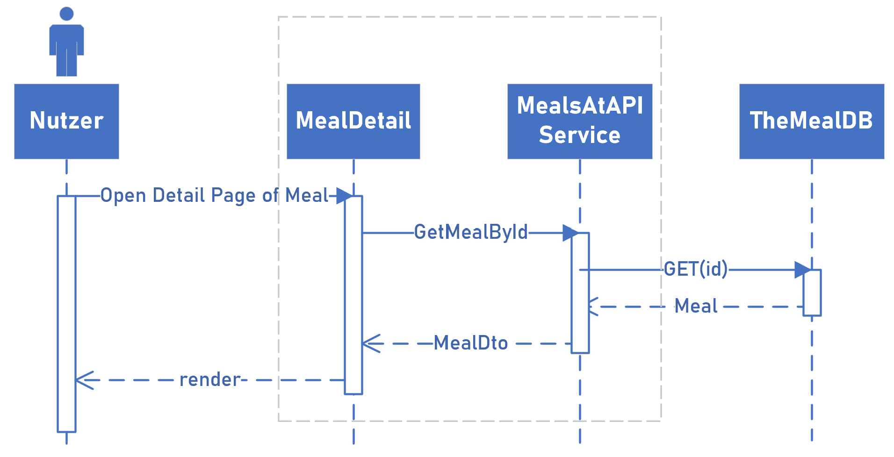

# Inhaltsverzeichnis

[1 Einführung und Ziele](#1-einführung-und-ziele)  
[2 Randbedingungen](#2-randbedingungen)  
[3 Kontextabgrenzung](#3-kontextabgrenzung)  
[4 Lösungsstrategie](#4-lösungsstrategie)  
[5 Bausteinsicht](#5-bausteinsicht)  
[6 Laufzeitsicht](#6-laufzeitsicht)  
[7 Verteilungssicht](#7-verteilungssicht)  
[8 Querschnittliche Konzepte](#8-querschnittliche-konzepte)  
[9 Architekturentscheidungen](#9-architekturentscheidungen)  
[10 Qualitätsanforderungen](#10-qualitätsanforderungen)  
[11 Risiken und technische Schulden](#11-risiken-und-technische-schulden)  
[12 Hinweise für Entwickler](#12-hinweise-für-entwickler)  
[Glossar](#glossar)  

# 1 Einführung und Ziele

Dieses Dokument beschreibt die Software-Architektur des Rezepte-Systems. Das System dient dem Finden und Abspeichern von Rezepten. Es soll im Internet einem breiten Publikum zur Verfügung stehen.

[comment]: <> (#############################################################################)

## 1.1 Qualitätsziele

Die folgende Tabelle beschreibt die zentralen Qualitätsziele des Rezeptesystems. Die Reihenfolge gibt dabei eine ungefähre Orientierung bezüglich der Wichtigkeit vor. 
  Die Qualitätsziele werden ergänzt und konkretisiert durch Qualitätsszenarien in Kapitel [10](#10-qualitätsanforderungen).
  Die Umsetzung der Qualitätsziele ist im Kapitel [Lösungsstrategie](#4-lösungsstrategie) zu finden.

| Qualitätsmerkmal | Ziel |
|-----------------|-----------------------------------|
| Security | Interne Schnittstellen des Rezeptesystem sind abgesichert. Es können keine Daten unauthorisiert manipuliert werden. |
| Wartbarkeit | Das Rezeptsystem soll für Entwickler und Admins leicht zu warten sein. |
| Erlernbarkeit | Entwickler finden sich schnell im Rezeptesystem zurecht, wodurch neuer Code und Builds schnell erstellt werden können. |
| Usability | Die Weboberfläche des Rezeptesystems soll möglichst intuitiv zu bedienen sein. |
| Performance | Das Rezeptsystem reagiert auf Eingaben vom Nutzer in angemessener Zeit. |
| Erweiterbarkeit | Das Rezeptesystem lässt sich leicht um neue Funktionalität(en) erweitern. Es kann auf lange Sicht dem technologischen Fortschritt bei Tools folgen.|
| Skalierbarkeit | Auch wenn das System wächst und Builds umfangreicher werden, ssoll das Rezeptesystem handhabbar und effizient bleiben. |
| Portierbarkeit | Die Anwendung soll auf verschiedene Betriebssysteme portiert werden können. |

## 1.2 Stakeholder

Die folgende Tabelle stellt die Stakeholder des Repetesystems und deren jeweilige Erwartungshaltung und Interessen dar.

| Stakeholder          | Erwartungshaltung                 |
|-----------------|-----------------------------------|
| Nutzer im Internet   | - Ansprechende, intuitive Bedienung und Funktion der Website   - Keine Fehler   - Keine Wartezeiten            |
| Entwickler   | - Gut wartbarer, erweiterbarer und lesbarer Code                  |
| Betreiber der TheMealDB-API  |-  Kein Missbrauch ihrer API                |

[comment]: <> (#############################################################################)

# 2 Randbedingungen

## 2.1 Technische Randbedingungen

| Thema       | Erläuterung                 |
|-----------------|-----------------------------------|
| Grafische Oberfläche | Nutzer können mittels einer Website mit dem System interagieren |
| Schutz vor Attacken | DDOs-Schutz, Eingabenschutz |
| Programmiersprache | Das Rezeptsystem wurde fullstack in C#6.0 (LTS) implementiert |
| Betriebssysteme | Das Rezeptsystem unterstützt (mindestens) Windows, Linux und MacOS. |
| Betriebsmodi| Das Rezeptsystem kann aus den wichtigsten IDEs, von Buildservern und von der Kommandozeile aus gestartet werden.|

## 2.2 Konventionen

| Thema       | Erläuterung                 |
|-----------------|-----------------------------------|
| Source Code | Quelltextverwaltung bei GitHub,   https://github.com/Kimbolini/sqs-receipe |
| Defect Tracking | Mittels GitHub issues:   https://github.com/Kimbolini/sqs-receipe/issues |
| Namensgebung | C# Programmierkonventionen:   https://learn.microsoft.com/en-us/dotnet/csharp/fundamentals/coding-style/coding-conventions  |
| Architekturdokumentation | Gliederung und Terminologie nach dem deutschen arc42-Template v.8.2|
| Sprache (de/en) | Der Quelltext ist in Englisch gehalten. Dies betrifft sowohl Benennungen von Methoden als auch Kommentare. |

[comment]: <> (#############################################################################)

# 3 Kontextabgrenzung

Die Kontextabgrenzung beschreibt das Umfeld des Rezeptsystems. 
Es zeigt die Benutzer und Fremdsysteme auf mit denen interagiert wird. 
  Da das Rezeptsystem recht klein ist, wurden fachlicher und technischer Kontext zusammengefasst.

### Menschlicher Nutzer 
Der Endnutzer, der von seinem Browser aus auf das Rezeptsystem zugreifen kann, um Rezepte zu suchen.

### TheMealDB (Fremdsystem)
Eine externe API aus der die Rezeptdaten geholt werden, die im Rezeptsystem dargestellt werden. 

[comment]: <> (#############################################################################)

# 4 Lösungsstrategie

Nachfolgend werden die Qualitätsziele aus [Kapitel 1](#1-einführung-und-ziele) aufgegriffen und die jeweiligen Lösungsansätze erläutert.

### Security
- Kapselung interner Services durch Businesslayer von nach außen sichtbaren Schnittstellen 
- Kapselung interner Datenmodelle durch Datentransferobjekte (DTOs)
- Aktivierte Github Secret Scanning Alerts
- Aktivierte Github-Dependabot-Alerts bei Vulnerabilities in verwendeten Paketen
- Snyk, für zusätzliche Überprüfung der Vulnerabilities von verwendeten Nuget-Paketen
- Security-Überprüfung bei jedem push auf den main-Branch in sonarcloud

### Wartbarkeit
- Modularer Aufbau des Quellcodes/der Subsysteme
- Verwendung wiederverwendbarer Komponenten, insbesondere im Frontend 
- Automatisches Ausführen von Unittests bei Pushes auf den Mainbranch
- Überprüfung der Codequalität mittels sonarcloud 
- Nachverfolgbarkeit durch Logging
- End-to-End/Frontend-Testing mittels cypress

### Erlernbarkeit
- Nutzung der offiziellen C#-Coding-Konventionen
- Eindeutige Methoden- und Klassenbenennung 
- Clean-Architecture  
-> Führt zu einfach zu lesendem, gut geordnetem Quellcode

### Usability
- Einfach gehaltene Website, für ein möglichst intuitives Nutzungserlebnis
- Nutzerfeedback, wenn der eine Aktion auf der Website anstößt

### Performance
- Verwendung von Datentransferobjekten (DTOs), um die benötigte Anzahl der Aufrufe zwischen internen Subsystemen zu reduzieren
- (Lasttest)

### Erweiterbarkeit
- Trennung in frontend und backend

### Skalierbarkeit
- Relationales Datenbankschema, um Mehrfachabspeicherung von Zutaten zu vermeiden.

### Portierbarkeit
- Verwendung der .NET Core Plattform mit Multiplattform-Unterstützung (mindestens Windows, Linux und Mac OS)

[comment]: <> (#############################################################################)

# 5 Bausteinsicht

Dieses Kapitel beschreibt die Zerlegung des Rezeptesystem in Module, wie sie auch in der Ordnerstruktur des C#-Quelltextes zu finden sind.

## 5.1 Ebene 1 

Das Rezeptesystem besteht aus zwei großen Subsystemen, die als separate Visual-Studio-Projekte realisiert wurden.

 
 

| Name | Kurzbeschreibung |
|--|--|
| frontend | Enthält die graphische Oberfläche zur Interaktion mit Nutzern und Logik, um mit der TheMealDB-API und dem Backend zu interagieren. |
| backend | Das Backend mit der Datenbank und dem Business Layer. B2 stellt Dienste zur Verfügung, um Daten aus der Datenbank zu holen/schreiben. |

## 5.2 Frontend (Blackbox)

### Zweck/Verantwortlichkeit

Dieses Subsystem stellt dem Nutzer eine grafische Oberfläche (GUI) zur Interaktion zur Verfügung. Die GUI besitzt zwei Seiten, die der Nutzer direkt aufrufen kann: _Home.razor_ und _Favoriten.razor_. 

### Schnittstellen

Das Subsystem stellt seine Funktionalität der Rezeptsuche über die Klassen  _MealsAtAPIService.cs_ und _MealsInDbService.cs_ zur Verfügung. _MealsAtAPIService_ wird dabei als Singleton vor Programmstart definiert und der Home-Website als Service zur Verfügung gestellt.

 
 

| Methode | Kurzbeschreibung |
|--|--|
| GetMealsFromAPI | Stellt eine GET-Anfrage an die TheMealDB-API für >= 1 Rezept. Dabei kann optional ein Suchbegriff mit übergeben werden. ||
| GetMealsFromDB | Stellt eine GET-Anfrage an das interne REST-Interface für alle verfügbaren Rezepte. |

### Ablageort/Datei

Der Code der Hauptseiten der Website ist unter _/frontend/Pages_ zu finden. Serviceklassen sind unter _/frontend/Services_ abgelegt.  
Eine Vorschau der zurückgegebenen Rezepte der TheMealDB-API wird durch die wiederverwendbaren Komponenten _MealPreviewListComp_ und _MealPreviewCardComp_ dargestellt. 
Diese sind unter _/frontend/Shared_ zu finden.

### Offene Punkte

Um in einem Multinutzerszenario sinnvolle Favoriten zur Verfügung stellen zu können, ist eine nutzerabhängige Unterscheidung und Speicherung der favorisierten Rezepte notwendig.
Dies könnte z.B. durch einen Login realisiert werden.

[comment]: <> (---------------------------------------------------------------------------)

## 5.3 Frontend - Ebene 2: Rezeptdetails

### Zweck/Verantwortlichkeit

Das Subsystem _frontend_ stellt die Möglichkeit zur Verfügung eine Detailseite von Rezepten aufzurufen und dort das Rezept den eigenen Favoriten hinzuzfügen.
Wird ein Rezept als Favorit markiert, wird es in die Datenbank gespeichert. 

### Schnittstellen

Das Modul stellt seine Funktionalität über die Klassen _MealsAtAPIService.cs_ und _MealsInDbService.cs_ zur Verfügung.
Die Seite _MealDetail_ entscheidet dabei anhand von URL-Parametern, welche der beiden Klassen benötigt wird.

| Methode | Kurzbeschreibung |
|--|--|
| GetMealByIdFromAPI | Stellt eine GET-Anfrage für ein spezifisches Rezept and die TheMealDB-API. |
| GetMealById | Stellt eine GET-Anfrage an das interne REST-Interface für ein spezifisches Rezept aus der Datenbank. |
| AddMealDtoToFavourites | Stellt eine POST-Anfrage an das interne REST-Interface um ein Rezept in die Datenbank zu speichern.|

### Ablageort/Datei

Die Detailseite von Rezepten zählt zu den Hauptseiten der Website und ist somit unter _/frontend/Pages_ abgelegt.
Die Serviceklassen unter _/frontend/Services_.

### Offene Punkte

- Die TheMealDB-API übermittelt mehr Daten als auf der Detailseite von Rezepten dargestellt werden. 
Die Daten stehen dem Subsystem _frontend_ zur Verfügung, werden allerdings noch nicht auf der Detailseite angezeigt.
- Im Subsystem _backend_ steht die Funktion zum Löschen eines Rezeptes aus der Datenbank teilweise zur Verfügung. 
Dadurch könnte ein Rezept aus den Favoriten entfernt werden. Diese Funktion ist im Subsystem _frontend_ bisher nicht implementiert.
- Falls es beim Hinzufügen eines Rezeptes zu den Favoriten zu einem Fehler kommt, erscheint fälschlicherweise eine Erfolgsmeldung für den Nutzer.

[comment]: <> (---------------------------------------------------------------------------)

## 5.4 Backend (Blackbox)

### Zweck/Verantwortlichkeit

Dieses Subsystem enhält die Datenbank, die favorisierte Rezepte abspeichert und stellt eine REST-Schnittstelle zur Interaktion mit der Datenabank zur Verfügung.

### Schnittstellen

Das Subsystem stellt seine Funktionalität über das Interface _MealController_ zur Verfügung. 
Dieses nutzt interne Services, um mit der Datenbank zu interagieren.

 
 

| Methode | Kurzbeschreibung |
|--|--|
| Get | Stellt alle Rezepte (Meals) aus der Datenbank zur Verfügung. |
| Get(id) | Stellt ein spefizisches Rezept (Meal) aus der Datenbank zur Verfügung. |
| Post | Stellt die Möglichkeit zur Verfügung ein neues Rezept in die Datenbank zu speichern. |
| CreateMeal | Erstellt ein Rezept (Meal) in der Datenbank und speichert die zugehörigen Zutaten und deren Menge. |
| GetMealById | Gibt ein spezifisches Rezept (Meal) aus der Datenbank zurück. |
| GetMeals | Gibt alle gespeicherten Rezepte (Meals) aus der Datenbank zurück. |
| RemoveMealById | Löscht ein spezifisches Rezept (Meal) aus der Datenbank. |

Die Methoden von _IngredientService_ und _MeasuredIngredientService_ funktionieren analog zu denen des _MealServices_ und was die Benennung vermuten lässt.

### Ablageort/Datei

Controller sind - wie alle Klassen/Methoden, die nach außen exposed werden - unter _/backend/Presentation/Controller_ abgelegt. 
Die internen Service-Klassen sind unter _/backend/Application_ gespeichert und werden als Teil des Businesslayers betrachtet.

### Offene Punkte
- Im _MealController_ besteht eine Methode, um Rezepte zu löschen. Es fehlt eine passende Methode in _MeasuredIngredientService_, um die Funktionalität zu vervollständigen.

## 5.5 Backend - Ebene 2: Datenbank

Die Rezepte werden nach nachfolgendem relationalen Datenbankschema abgelegt. 
Dadurch wird unter anderem garantiert, dass Zutaten (_Ingredients_) unabhängig von Rezepeten (_Meals_) existieren können und nicht mehrfach abgespeichert werden.

 
 

| Tabelle | Kurzbeschreibung |
|--|--|
| Meal | Enthält die Hauptdaten von Rezepten. Die Attribute sind anhand der übertragenen Daten aus der externen TheMealDB-API gewählt. Ein Minimalrezept enthält einen Namen, Instruktionen und mindestens eine Ingredient und ein MeasuredIngredient.|
| Ingredient | Zutaten von Rezepten. |
| MeasuredIngredient | Kombiniert Rezepte mit den Zutaten und fügt für jede Zutat die benötigte Menge hinzu. |

[comment]: <> (#############################################################################)

# 6 Laufzeitsicht 

Nachfolgend soll anhand von zwei Beispielen das unterschiedliche Zusammenspiel der Bausteine verdeutlicht werden.

## Rezeptdetailsicht API

Die Seite _MealDetail_ entscheidet zuerst, ob der Nutzer eine Anfrage an ein Rezept von der TheMealDB-API oder aus der internen Datenbank gestellt hat.
In diesem Fall sollen die Detailinfos des Rezepts von der externen API geholt werden.
  _MealDetail_ nutzt den Service _MealsAtAPIService_, der widerum eine GET-Anfrage an die externe TheMealDB-API stellt.
Die Antwort der API (sofern nicht leer) wird in internes Datenmodell _MealDto_ umgewandelt, an die Website _MealDetail_ weitergereicht und schließlich für den Endnutzer dargestellt.

## Rezeptdetailsicht Datenbank

Die Seite _MealDetail_ entscheidet zuerst, ob der Nutzer eine Anfrage an ein Rezept von der TheMealDB-API oder aus der internen Datenbank gestellt hat.
In diesem Fall sollen die Detailinfos des Rezepts aus der internen Datenbank geholt werden.
  _MealDetail_ nutzt den Service _MealsInDBService_, der widerum eine GET-Anfrage an die interne REST-Schnittstelle stellt, die vom Interface _MealController_ bereitgestellt wird.
Intern wird die Anfrage an _MealService_ weitergereicht, der die benötigten Daten aus der Datenbank anfragt.
  Die benötigten Daten werden aus den Tabellen _Meals_, _Ingredients_ und _MeasuredIngredients_ geholt, vom _MealService_ in ein DTO konvertiert und bis zum Frontend weitergereicht.
Dort werden die Daten schließlich für den Endnutzer dargestellt.

[comment]: <> (#############################################################################)

# 7 Verteilungssicht 

Derzeit out of scope, da ein Deployment des Rezeptsystems mit Docker nicht realisiert wurde. 

[comment]: <> (#############################################################################)

# 8 Querschnittliche Konzepte

## 8.1 *Logging* 

Transaktionen in der Datenbank werden mittels Logger aufgezeichnet.

## 8.2 *Transaktionalität* 

*\<Erklärung>*

...

## 8.3 *Security* 

Haben wir laut Leander nicht? Dachte schon?

## 8.4 Ausnahme- und Fehlerbehandlung

HTT

FPr 

[comment]: <> (#############################################################################)

# 9 Architekturentscheidungen 

| Architekturteil | Entscheidung |
|--|--|
| Platform | .NET Core v6.0 |
| Webframework | Blazor  |
| Interne Schnittstelle | REST |
| Datenbankservice | MySQL |
| Softwarearchitektur | 3-Schichten-Architektur |
| Aufgabenverteilung| Client-Server-Modell |
| Programmiersprache | C# v10 |

[comment]: <> (#############################################################################)

# 10 Qualitätsanforderungen

Die Qualitätsanforderungen erweitern die Qualitätsziele aus [Kapitel 1](#1-einführung-und-ziele) und konkretisieren sie anhand eines Qualitätsbaums und zusätzlichen Qualitätsszenarien.

## 10.1 Qualitätsbaum 

## 10.2 Qualitätsszenarien 

Nachfolgende Qualitätsszenarien sind ergänzend zu denen im Qualitätsbaum zu betrachten.
- Wenn ein Nutzer während des Normalbetriebs eine Suchanfrage an die Website stellt, soll das Ergebnis innerhalb von 2s angezeigt werden.
- Wenn ein Nutzer ein Rezept zu seinen Favoriten hinzufügt, soll eine sofortige grafische Rückmeldung an ihn erfolgen, ob die Aktion erfolgreich war.
- Wenn die interne Datenbank oder REST-Schnittstelle nicht verfügbar sind, soll ein grafisches Hinweis an den Nutzer erfolgen.
- Wenn ein Server während des Normalbetriebs ausfällt, soll das System den Administrator informieren und innerhalb (mithilfe eines Backupservers) von 1min wieder funktionieren.
- Wenn ein Angreifer eine DOS-Attacke startet, soll dies vom System rechtzeitig erkannt werden und weitere Anfragen von der IP-Adresse blockieren.

[comment]: <> (#############################################################################)

# 11 Risiken und technische Schulden

## 11.1 Risiken
Folgende Risiken wurden zu Beginn der Planung des Rezeptsystems als mögliche Probleme identifiziert:

1. TheMealDB-API antwortet nicht
2. Die interne REST-Schnittstelle antwortet nicht
3. Zu viele Anfragen an die interne Datenbank in zu kurzer Zeit
4. Zu viele Anfragen an die externe API in zu kurzer Zeit

## 11.2 Technische Schulden und offene Punkte

1. Keine Unterstützung von HTTPS in der internen API
2. Kein Deployment
3. Lasttests, Frontendtest und Snyk können in die Github Actions integriert werden
4. Ausbauen der Unittests und des Loggings

[comment]: <> (#############################################################################)

# 12 Hinweise für Entwickler

1. Das Projekt kann derzeit nur lokal gebaut werden
- Installiere Mysql
- Definiere frontend und backend als Startprojekt
- Starte
2. Verwendung von Cypress
- Starte Anwendung
- Starte Test in der (Power)shell: npx cypress run --record --key f35afd48-b425-472a-b153-0b7ebe98afa3
- Ergebnis zu sehen in: https://cloud.cypress.io/projects/yvz8if/runs/1/overview?roarHideRunsWithDiffGroupsAndTags=1
3. Verwendung der K6 Lasttests
- Starte Anwendung
- In der (Power)shell: Navigiere zum Verzeichnis _scripts_
- Starte Test in der (Power)shell: k6 run _<some\>-test.js_
- Ergebnis: direkt in der commandline
4. Verwendung von Sonarcloud
- Startet automatisch bei jedem Push auf den Main-Branch und Pullrequests
- Ergebnis zu sehen in: https://sonarcloud.io/summary/overall?id=Kimbolini_sqs-receipe
5. Verwendung der Unittests
- Starten zusammen mit Sonarcloud und werden im zugehörigen Dashboard angezeigt
- Alternativ manuell: im Projekt rechtsklick auf _testBackend_ -> _Tests ausführen_
6. Verwendung von Snyk
- Startet automatisch bei jedem Push auf den Main-Branch
- Ergebnis zu sehen in: https://app.snyk.io/org/kimbolini 

[comment]: <> (#############################################################################)

# Glossar

| Begriff | Erläuterung |
|--|--|
| API | Application Programming Interface. In diesem Dokument nur REST-APIs. |
| backend | Bezeichnet in diesem Dokument das Subsystem, das Datenbank und Businesslayer enthält. |
| DTO | Datentransferobjekt |
| frontend | Bezeichnet in diesem Dokument das Subsystem, das die GUI und Logik zur Interaktion mit dem backend enthält. |
| GUI | Graphical User Interface - Die grafische Oberfläche zur Interaktion mit dem Nutzer. Hier eine Website. |
| Ingredient | Eine Tabelle in der Datenbank des Rezeptsystems. Enthält Zutaten von Rezepten. |
| Meal | Eine Tabelle in der Datenbank des Rezeptsystems. Hauptbestandteil jedes Rezepts. |
| MeasuredIngredients | Eine Tabelle in der Datenbank des Rezeptsystems. Enthält eine Ingredient, ein Meal und die benötigte Menge einer Zutat |
| REST | Representational State Transfer. Der im Rezeptsystem genutzte API-Typ. |

[comment]: <> (#############################################################################)

## Über arc42

arc42, das Template zur Dokumentation von Software- und
Systemarchitekturen.

Template Version 8.2 DE. (basiert auf AsciiDoc Version), Januar 2023

Created, maintained and © by Dr. Peter Hruschka, Dr. Gernot Starke and
contributors. Siehe <https://arc42.org>.
