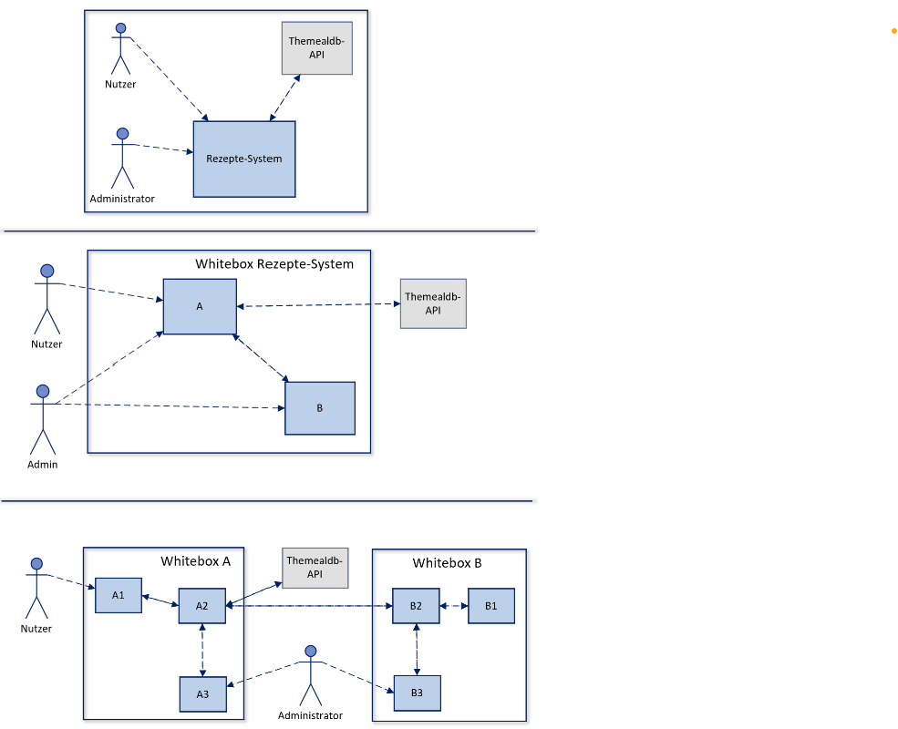

Inhaltsverzeichnis 
 

[[_TOC_]]

Inhaltsverzeichnis2 
 

[Einführung und Ziele](#einführung-und-ziele)  
[Randbedingungen](#randbedingungen)  
[Kontextabgrenzung](#kontextabgrenzung)  
[Lösungsstrategie](#lösungsstrategie)  
[Bausteinsicht](#bausteinsicht)  
[Laufzeitsicht](#laufzeitsicht)  
[Verteilungssicht](#verteilungssicht)  
[Querschnittliche Konzept](#querschnittliche-konzept)  
[Architekturentscheidungen](#architekturentscheidungen)  
[Qualitätsanforderungen](#qualitätsanforderungen)  
[Risiken und technische Schulden](#risiken-und-technische-schulden)  
[Was ist wie abgesichert](#was-ist-wie-abgesichert)  
[Glossar](#glossar)  

# 

**Über arc42**

arc42, das Template zur Dokumentation von Software- und
Systemarchitekturen.

Template Version 8.2 DE. (basiert auf AsciiDoc Version), Januar 2023

Created, maintained and © by Dr. Peter Hruschka, Dr. Gernot Starke and
contributors. Siehe <https://arc42.org>.

# Einführung und Ziele

Dieses Dokument beschreibt die Software-Architektur des Rezeptedatenbank-Systems. Das System dient dem Finden und Abspeichern von Rezepten. Es soll im Internet einem breiten Publikum zur Verfügung stehen.

## Qualitätsziele

## Stakeholder

| Stakeholder          | Erwartungshaltung                 |
|-----------------|-----------------------------------|
| Nutzer im Internet   | Schnelle, intuitive Bedienung und Funtkion der Website. Keine Bugs, keine Wartezeiten                  |
| Entwickler   | refactorable, gut lesbarer Code                  |
| API-Menschen?   | Kein Abuse ihrer API                |
|     |               |

test

# Randbedingungen

| Randbedingung         | Erläuterung                 |
|-----------------|-----------------------------------|
| Grafische Oberfläche | Website  |
| Schutz vor Attacken | DDOs-Schutz, Eingabenschutz |
| Skalierbarkeit | Falls die Nutzungshäufigkeit der Anwendung steigt  |
| Datenschutz?  |   |

# Kontextabgrenzung

Nachfolgend wird das Umfeld beschrieben. Für welchen Nutzer das System erstellt wurde und mit welchen Fremdsystem es interagiert. 

## Fachlicher Kontext

**\<Diagramm und/oder Tabelle>**

**\<optional: Erläuterung der externen fachlichen Schnittstellen>**

## Technischer Kontext

**\<Diagramm oder Tabelle>**

**\<optional: Erläuterung der externen technischen Schnittstellen>**

**\<Mapping fachliche auf technische Schnittstellen>**

# Lösungsstrategie

# Bausteinsicht

## Whitebox Gesamtsystem

Begründung

Frontend und Backend werden zur Kapselung der Businesslogik und für bessere Skalierbarkeit aufgeteilt.

Enthaltene Bausteine

| Name | Verantwortung |
|--|--|
| A | Das Backend mit der Datenbank A1 und dem Business Layer A2. A2 stellt Dienste zur Verfügung, um Daten aus der Datenbank zu holen/schreiben. A3 dient dem Administrator zur Wartung. |
| B | Das Frontend mit der graphischen Oberfläche B1 und Logik B2, um mit der mealdb-API und dem Backend zu interagieren. B3 dient dem Administrator zur Wartung und Einsicht des aktuellen Zustands des Systems. |

Wichtige Schnittstellen

- Frontend - themealdb API: Kommunikation über REST-Schnittstelle der mealdb-API
- Frontend - backend: Die beiden Dienste kommunizieren über eine REST-Schnittstelle

### \<Name Blackbox 1> 

*\<Zweck/Verantwortung>*

*\<Schnittstelle(n)>*

*\<(Optional) Qualitäts-/Leistungsmerkmale>*

*\<(Optional) Ablageort/Datei(en)>*

*\<(Optional) Erfüllte Anforderungen>*

*\<(optional) Offene Punkte/Probleme/Risiken>*

### \<Name Blackbox 2> 

*\<Blackbox-Template>*

### \<Name Blackbox n> 

*\<Blackbox-Template>*

### \<Name Schnittstelle 1> 

...

### \<Name Schnittstelle m> 

## Ebene 2

### Whitebox *\<Baustein 1>* 

*\<Whitebox-Template>*

### Whitebox *\<Baustein 2>* 

*\<Whitebox-Template>*

...

### Whitebox *\<Baustein m>* 

*\<Whitebox-Template>*

## Ebene 3

### Whitebox \<\_Baustein x.1\_\> 

*\<Whitebox-Template>*

### Whitebox \<\_Baustein x.2\_\> 

*\<Whitebox-Template>*

### Whitebox \<\_Baustein y.1\_\> 

*\<Whitebox-Template>*

# Laufzeitsicht 

## *\<Bezeichnung Laufzeitszenario 1>* 

-   \<hier Laufzeitdiagramm oder Ablaufbeschreibung einfügen>

-   \<hier Besonderheiten bei dem Zusammenspiel der Bausteine in diesem
    Szenario erläutern>

## *\<Bezeichnung Laufzeitszenario 2>* 

...

## *\<Bezeichnung Laufzeitszenario n>* 

...

# Verteilungssicht 

## Infrastruktur Ebene 1 

***\<Übersichtsdiagramm>***

Begründung

:   *\<Erläuternder Text>*

Qualitäts- und/oder Leistungsmerkmale

:   *\<Erläuternder Text>*

Zuordnung von Bausteinen zu Infrastruktur

:   *\<Beschreibung der Zuordnung>*

## Infrastruktur Ebene 2

### *\<Infrastrukturelement 1>* 

*\<Diagramm + Erläuterungen>*

### *\<Infrastrukturelement 2>* 

*\<Diagramm + Erläuterungen>*

...

### *\<Infrastrukturelement n>* 

*\<Diagramm + Erläuterungen>*

# Querschnittliche Konzept

## *\<Konzept 1>* 

*\<Erklärung>*

## *\<Konzept 2>* 

*\<Erklärung>*

...

## *\<Konzept n>* 

*\<Erklärung>*

# Architekturentscheidungen 

# Qualitätsanforderungen

::: formalpara-title
**Weiterführende Informationen**
:::

Siehe [Qualitätsanforderungen](https://docs.arc42.org/section-10/) in
der online-Dokumentation (auf Englisch!).

## Qualitätsbaum 

## Qualitätsszenarien 

# Risiken und technische Schulden

# Was ist wie abgesichert

- Performanceanforderungen - wieviel Anfragen pro Sekunde? Wie schnell?
- Rest service testen - Unit-Tests?
- Statische Codequalität abgesichert über .. 
- Lint (z.B. für Dockerimage) 
- Sync, trivy (Tools um zB wegen Dependencies zu überprüfen)

# Glossar

| Begriff               | Definition                                    |
|--|--|
| *\<Begriff-1>*        | *\<Definition-1>*                             |
| *\<Begriff-2*         | *\<Definition-2>*                             |
